# Chapter 4: System Design — Cloud Backend Architecture

## 4.4 Cloud Backend Architecture

### 4.4.1 Overview

The HazeClue platform employs a **dual-backend strategy** to serve its two distinct client applications. Each backend is purpose-built with a technology stack optimized for its specific use case:

- **Mobile Backend (.NET 8 Web API):** Serves the Flutter mobile application for individual users. Built with ASP.NET Core 8 following Clean Architecture principles, it provides a strongly-typed, enterprise-grade API for user authentication, focus session management, device registration, and personal cognitive data storage using Microsoft SQL Server.

- **Web Platform Backend (NestJS + MongoDB):** Serves the Nuxt.js web monitoring platform for educational institutions. Built with NestJS (Node.js/TypeScript), it provides a modular, event-driven API with real-time WebSocket capabilities for live classroom attention monitoring, session management, report generation, and collaborative analytics using MongoDB Atlas.

Both backends share a common **JWT (JSON Web Token)** authentication paradigm, ensuring a consistent and secure authentication flow across the entire ecosystem.

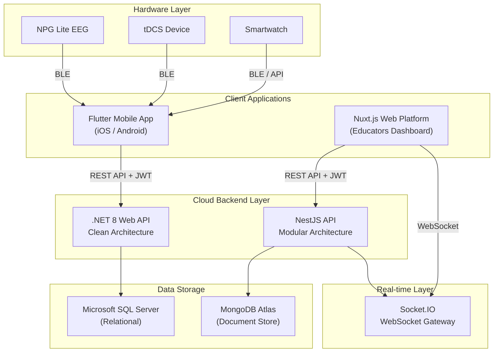
**Figure 4.1:** Dual-Backend System Architecture — The Flutter app communicates with the .NET 8 API, while the web platform communicates with the NestJS API and WebSocket gateway.

**Table 4.1:** Technology Stack Comparison

| Aspect | Mobile Backend | Web Platform Backend |
|---|---|---|
| **Framework** | ASP.NET Core 8 | NestJS 11 (TypeScript) |
| **Architecture** | Clean Architecture (3-layer) | Modular Architecture (feature modules) |
| **Database** | SQL Server (EF Core) | MongoDB Atlas (Mongoose ODM) |
| **Authentication** | ASP.NET Identity + JWT | Passport JWT + OAuth 2.0 |
| **Real-time** | — | Socket.IO WebSocket |
| **API Style** | RESTful with URL versioning | RESTful with global prefix |
| **Testing** | xUnit (Controller, Service, Integration) | Jest (Unit + E2E) |

---

### 4.4.2 Mobile Backend Architecture (.NET 8 Clean Architecture)

The mobile backend follows the **Clean Architecture** pattern, which enforces a strict separation of concerns across three distinct layers. This ensures that business logic remains independent of frameworks, databases, and external interfaces.

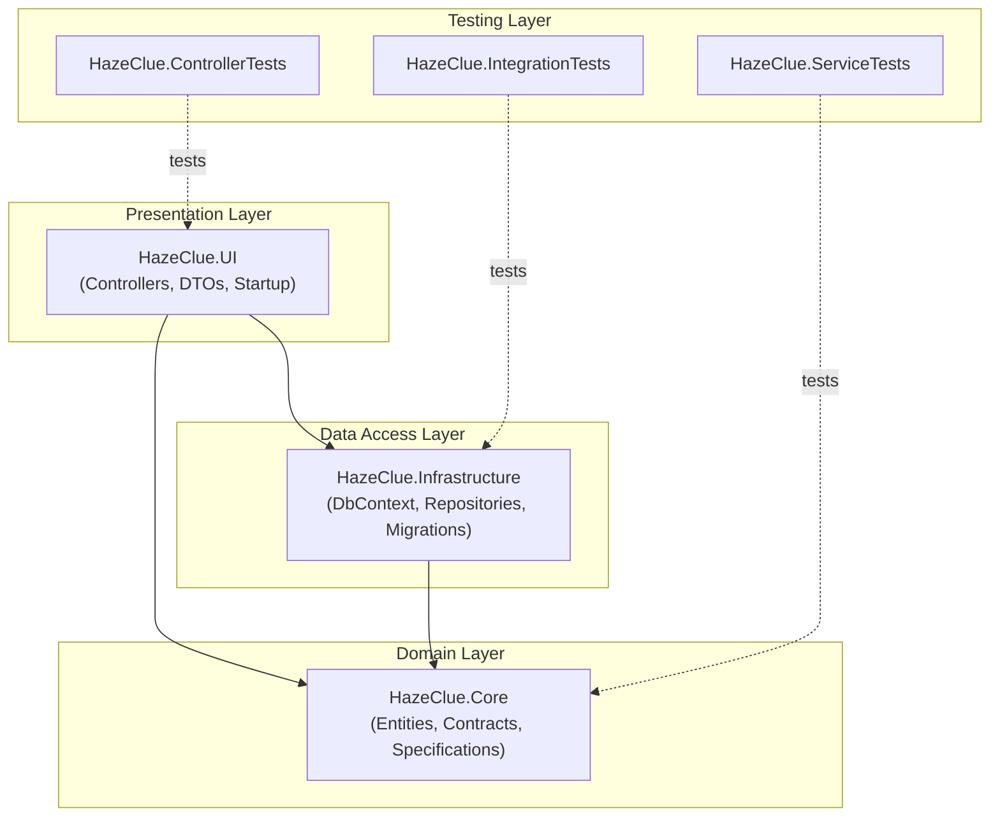
**Figure 4.2:** .NET 8 Clean Architecture Layer Diagram — Dependencies flow inward toward the Domain layer.

**Table 4.2:** Clean Architecture Layer Responsibilities

| Layer | Project | Responsibility |
|---|---|---|
| **Domain (Core)** | `HazeClue.Core` | Domain entities (`AppUser`, `Device`, `FocusSession`, `AppNotification`), repository interfaces (`IGenericRepository`, `IUnitOfWork`), specification contracts (`ISpecification`) |
| **Infrastructure** | `HazeClue.Infrastructure` | Entity Framework Core `ApplicationDbContext`, `GenericRepository<T>` implementation, `UnitOfWork` implementation, `SpecificationEvaluator`, database migrations |
| **Presentation (UI)** | `HazeClue.UI` | ASP.NET Core Web API controllers, Data Transfer Objects (DTOs), JWT authentication middleware, Swagger/OpenAPI configuration, API versioning, CORS policy |

#### 4.4.2.1 Design Patterns

The mobile backend implements three fundamental design patterns to ensure maintainability, testability, and scalability:

**Generic Repository Pattern**

The Generic Repository abstracts all data access operations behind a common interface, enabling any entity inheriting from `BaseClass` to leverage standardized CRUD operations without duplicating data access logic.

```csharp
public interface IGenericRepository<T> where T : BaseClass
{
    Task AddAsync(T entity);
    void Delete(T entity);
    Task<T?> GetByIdAsync(int id);
    Task<IEnumerable<T>> GetAllAsync();
    void Update(T entity);
    Task<T?> GetEntityWithSpecAsync(ISpecification<T> spec);
    Task<IEnumerable<T>> GetAllWithSpecAsync(ISpecification<T> spec);
    void RemoveRange(IEnumerable<T> entities);
}
```

**Unit of Work Pattern**

The Unit of Work coordinates multiple repository operations within a single database transaction, ensuring atomicity and consistency of data modifications.

```csharp
public interface IUnitOfWork : IAsyncDisposable
{
    IGenericRepository<T> Repository<T>() where T : BaseClass;
    Task<int> CompleteAsync();
}
```

**Specification Pattern**

The Specification Pattern encapsulates query criteria into reusable specification objects, allowing complex filtering and including related entities without scattering query logic across the codebase.

#### 4.4.2.2 Domain Entities

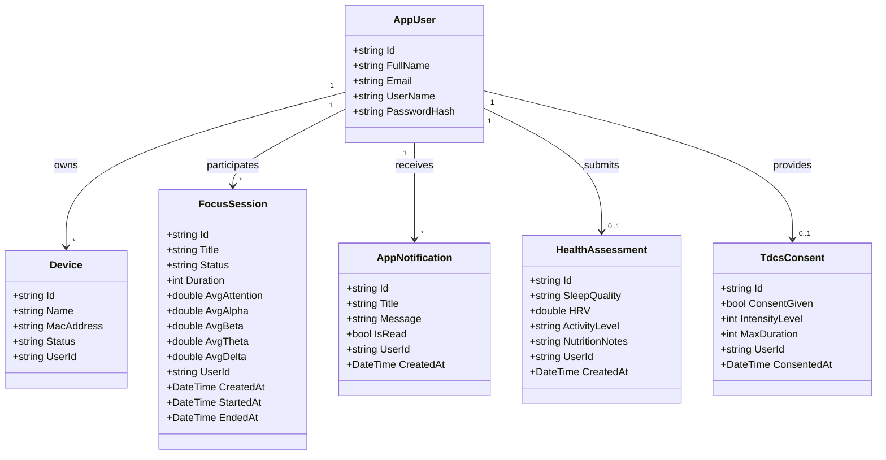
**Figure 4.3:** Mobile Backend Domain Entity Class Diagram — Shows the relationships between core domain entities.

#### 4.4.2.3 API Controller Architecture

The mobile backend exposes its functionality through versioned RESTful API controllers, all inheriting from a `CustomControllerBase` that enforces consistent routing and JSON formatting.

```csharp
[Route("api/v{version:apiVersion}/[controller]")]
[ApiController]
public class CustomControllerBase : ControllerBase { }
```

**Authentication Flow (AccountController):**

```csharp
[HttpPost("register")]
public async Task<IActionResult> Register([FromBody] RegisterDto dto)
{
    var user = new AppUser
    {
        Id = Guid.NewGuid().ToString(),
        UserName = dto.Email,
        Email = dto.Email,
        FullName = dto.FullName
    };
    var result = await _userManager.CreateAsync(user, dto.Password);
    var token = GenerateJwtToken(user);
    return StatusCode(201, new { access_token = token, user = new { ... } });
}
```

The JWT token is generated using HMAC-SHA256 signing with configurable issuer, audience, and expiration:

```csharp
private string GenerateJwtToken(AppUser user)
{
    var claims = new List<Claim>
    {
        new Claim(JwtRegisteredClaimNames.Sub, user.Id),
        new Claim(JwtRegisteredClaimNames.Email, user.Email),
        new Claim(JwtRegisteredClaimNames.Name, user.FullName),
        new Claim(JwtRegisteredClaimNames.Jti, Guid.NewGuid().ToString())
    };
    var key = new SymmetricSecurityKey(Encoding.UTF8.GetBytes(secretKey));
    var creds = new SigningCredentials(key, SecurityAlgorithms.HmacSha256);
    var token = new JwtSecurityToken(issuer, audience, claims, expires, creds);
    return new JwtSecurityTokenHandler().WriteToken(token);
}
```

---

### 4.4.3 Web Platform Backend Architecture (NestJS + MongoDB)

The web platform backend is built with **NestJS**, a progressive Node.js framework that leverages TypeScript and a modular architecture inspired by Angular. Each feature is encapsulated in a self-contained module with its own controller, service, schema, and DTOs.

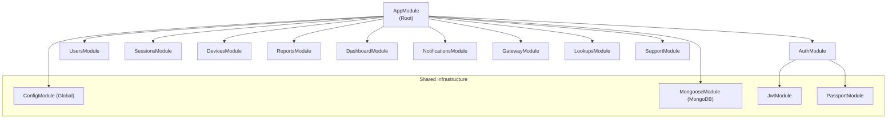
**Figure 4.4:** NestJS Modular Architecture — Each feature module is independently maintainable and testable.

**Table 4.3:** NestJS Module Responsibilities

| Module | Components | Responsibility |
|---|---|---|
| **AuthModule** | Controller, Service, JWT/Google/Facebook Strategies | User registration, login, OAuth 2.0 (Google & Facebook), OTP-based password reset, token generation |
| **UsersModule** | Controller, Service, User Schema | Profile management (CRUD), avatar upload, password change, soft-delete account deactivation |
| **SessionsModule** | Controller, Service, Gateway, Session Schema | Full session lifecycle (Create → Start → Pause → End), timeline markers, CSV/PDF export, live data polling |
| **DevicesModule** | Controller, Service, Device Schema | EEG device registration with serial number uniqueness, status tracking, CRUD operations |
| **ReportsModule** | Controller, Service, Report Schema | Post-session report generation, attention analytics aggregation, historical report retrieval |
| **DashboardModule** | Controller, Service | Real-time statistics aggregation (avg attention, active sessions, device counts, attention trends) |
| **NotificationsModule** | Controller, Service, Notification Schema | In-app notification creation, real-time WebSocket broadcast, read/unread management |
| **GatewayModule** | EegGateway, TelemetryController | WebSocket server for real-time EEG telemetry data broadcast, session room management |
| **LookupsModule** | Controller | Static reference data (subjects, grade levels) for session configuration |
| **SupportModule** | Controller | Help and support endpoints |

#### 4.4.3.1 NestJS Request Lifecycle

Every incoming HTTP request passes through the following pipeline:

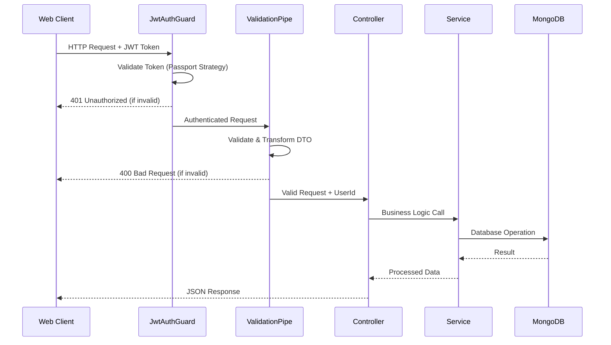
**Figure 4.5:** NestJS Request Lifecycle — Shows the guard, validation, and service layers.

#### 4.4.3.2 OAuth 2.0 Social Authentication

The web platform supports social authentication via Google and Facebook OAuth 2.0, implemented using Passport.js strategies:

```typescript
// auth.service.ts — OAuth Login Flow
async validateOAuthLogin(profile: any, provider: string): Promise<string> {
    const email = profile.emails?.[0]?.value?.toLowerCase();
    let user = await this.usersService.findByEmail(email);

    if (!user) {
        // Create new user from OAuth profile
        user = await this.usersService.create({
            fullName: profile.displayName || email.split('@')[0],
            email: email,
            status: 1,
            provider: provider,
            providerId: profile.id,
            avatar: profile.photos?.[0]?.value,
        });
    }
    return this._signToken(user.id, user.email);
}
```

#### 4.4.3.3 Session Lifecycle Management

The session module implements a complete state machine for monitoring sessions:

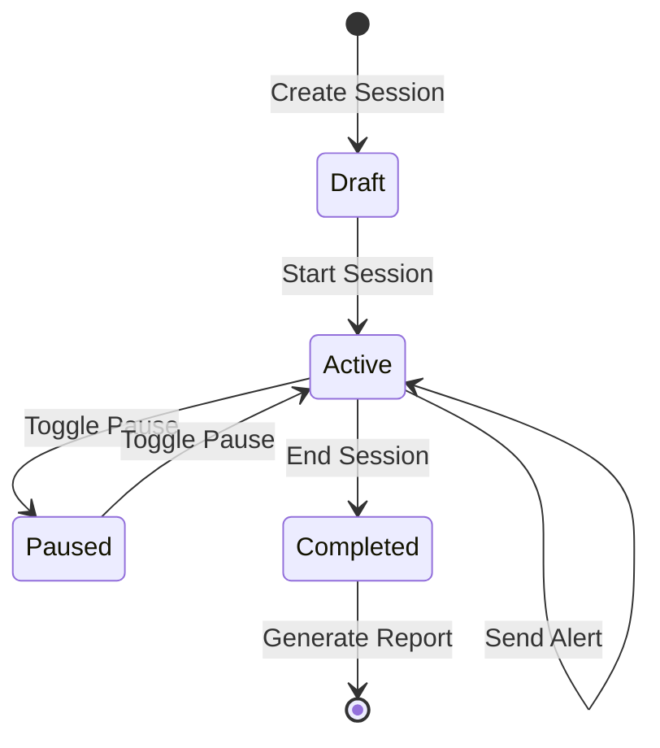
**Figure 4.6:** Session State Machine — Sessions transition through draft, active, paused, and completed states.

The session service manages all state transitions with validation:

```typescript
async start(userId: string, id: string): Promise<SessionDocument> {
    const session = await this.findOne(userId, id);
    if (session.status === 'active')
        throw new BadRequestException('Session is already active');
    if (session.status === 'completed')
        throw new BadRequestException('Session is already completed');
    session.status = 'active';
    session.startedAt = new Date();
    return session.save();
}
```

#### 4.4.3.4 PDF Report Generation

The platform generates professional session analytics reports using PDFKit:

```typescript
async generatePdfExport(userId: string, id: string): Promise<any> {
    const session = await this.findOne(userId, id);
    const doc = new PDFDocument({ margin: 50, size: 'A4', bufferPages: true });

    // Header with branding
    doc.roundedRect(40, 40, doc.page.width - 80, 100, 10).fill('#6C4EFD');
    doc.fillColor('#FFFFFF').fontSize(24).font('Helvetica-Bold')
       .text('Session Analytics Report', 60, 60);

    // Session Overview, Engagement Summary, Timeline Markers Table
    // ... (generates multi-page branded PDF with charts and tables)

    doc.end();
    return doc;
}
```

---

### 4.4.4 Database Design

The HazeClue platform uses two distinct database systems, each chosen to match the data access patterns and scalability requirements of its respective backend.

#### 4.4.4.1 Mobile Backend — SQL Server (Entity Relationship Diagram)

The mobile backend uses Microsoft SQL Server with Entity Framework Core as the ORM. The database schema is defined through C# entity classes and configured via the `ApplicationDbContext`. ASP.NET Identity tables are remapped to a dedicated `Security` schema for organizational clarity.

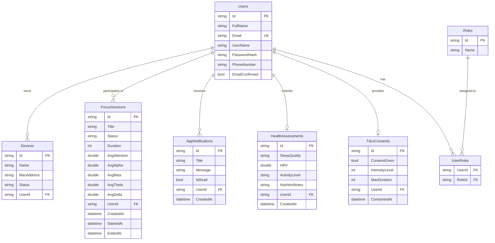
**Figure 4.7:** Mobile Backend Entity Relationship Diagram — SQL Server schema with ASP.NET Identity integration.

The `ApplicationDbContext` configures the Identity tables under a `Security` schema:

```csharp
protected override void OnModelCreating(ModelBuilder modelBuilder)
{
    base.OnModelCreating(modelBuilder);
    modelBuilder.Entity<AppUser>().ToTable("Users", "Security");
    modelBuilder.Entity<IdentityRole>().ToTable("Roles", "Security");
    modelBuilder.Entity<IdentityUserRole<string>>().ToTable("UserRoles", "Security");
    modelBuilder.Entity<IdentityUserClaim<string>>().ToTable("UserClaims", "Security");
    modelBuilder.Entity<IdentityUserLogin<string>>().ToTable("UserLogins", "Security");
    modelBuilder.Entity<IdentityRoleClaim<string>>().ToTable("RoleClaims", "Security");
    modelBuilder.Entity<IdentityUserToken<string>>().ToTable("UserTokens", "Security");
}
```

#### 4.4.4.2 Web Platform — MongoDB (Document Schema Design)

The web platform uses MongoDB Atlas, a cloud-hosted NoSQL document database. Schemas are defined using Mongoose decorators in NestJS, providing a flexible yet structured approach to data modeling.

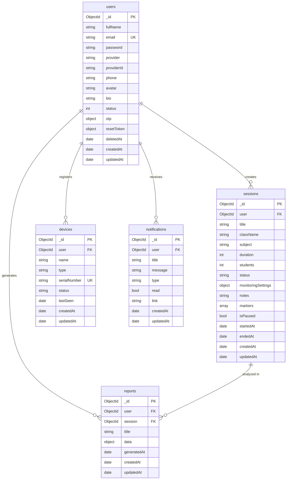
**Figure 4.8:** Web Platform MongoDB Document Schema Diagram — Shows collections and their relationships via ObjectId references.

**User Schema (Mongoose):**

```typescript
@Schema({ timestamps: true })
export class User {
  @Prop({ required: true, trim: true })
  fullName: string;

  @Prop({ required: true, unique: true, lowercase: true, trim: true })
  email: string;

  @Prop({ required: function() { return this.provider === 'local'; } })
  password?: string;

  @Prop({ type: String, enum: ['local', 'google', 'facebook'], default: 'local' })
  provider: string;

  @Prop() providerId?: string;
  @Prop() avatar?: string;
  @Prop({ default: 0 }) status: number; // 0 = unverified, 1 = active
  @Prop() deletedAt?: Date;
}
```

**Session Schema (Mongoose):**

```typescript
@Schema({ timestamps: true })
export class Session {
  @Prop({ type: Types.ObjectId, ref: User.name, required: true, index: true })
  user: Types.ObjectId;

  @Prop({ required: true, trim: true })
  title: string;

  @Prop({ type: String, enum: ['draft', 'scheduled', 'active', 'completed'], default: 'draft' })
  status: string;

  @Prop({ type: [{ timestamp: { type: Date }, label: { type: String } }], default: [] })
  markers: Array<{ timestamp: Date; label: string }>;

  @Prop() startedAt?: Date;
  @Prop() endedAt?: Date;
}
```

**Table 4.4:** Database Technology Comparison

| Feature | SQL Server (Mobile) | MongoDB (Web Platform) |
|---|---|---|
| **Data Model** | Relational tables with foreign keys | Document collections with ObjectId refs |
| **Schema** | Strict, migration-based | Flexible, decorator-based |
| **ORM/ODM** | Entity Framework Core | Mongoose ODM |
| **Indexing** | Identity-managed + custom | Compound indexes on user + timestamps |
| **Transactions** | Full ACID transactions via UnitOfWork | MongoDB transactions (multi-document) |
| **Query** | LINQ expressions + Specification Pattern | Mongoose chainable queries |
| **Hosting** | Local SQL Server instance | MongoDB Atlas (cloud-hosted) |

---

### 4.4.5 Real-time Communication (WebSocket Architecture)

The web platform implements real-time bidirectional communication using **Socket.IO** through NestJS WebSocket Gateways. This enables live classroom attention monitoring, where EEG telemetry data is broadcast to connected educator dashboards in real time.

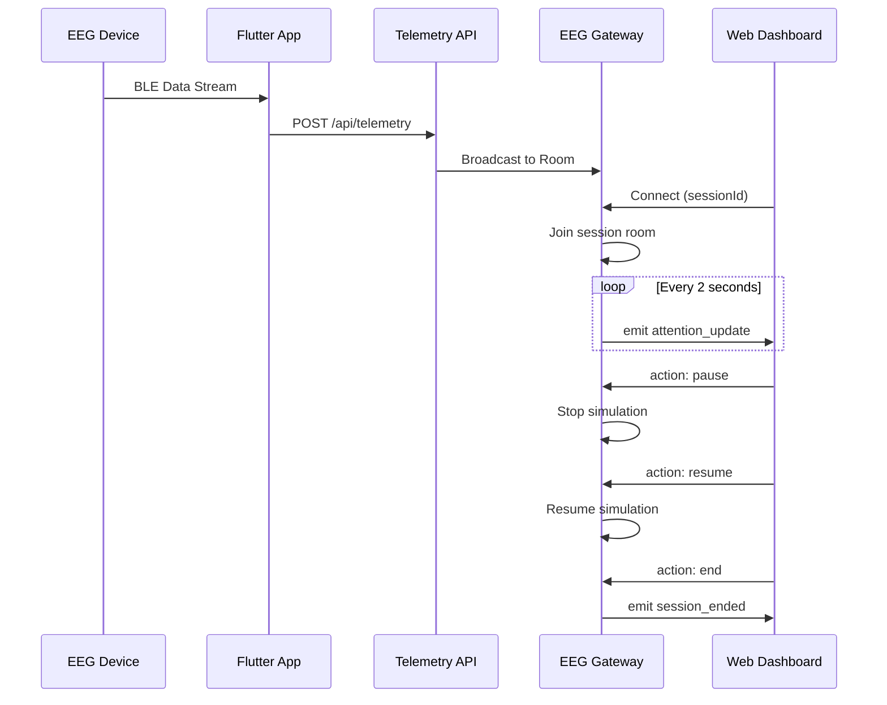
**Figure 4.9:** WebSocket Real-time Communication Flow — EEG data flows from devices through the API to connected web dashboards.

#### 4.4.5.1 Gateway Implementation

The `EegGateway` manages WebSocket connections using session-based rooms:

```typescript
@WebSocketGateway({ cors: { origin: '*' } })
export class EegGateway implements OnGatewayInit, OnGatewayConnection, OnGatewayDisconnect {
  @WebSocketServer() server: Server;
  private simulationIntervals: Map<string, NodeJS.Timeout> = new Map();

  handleConnection(client: Socket) {
    const sessionId = client.handshake.query.sessionId as string;
    if (sessionId) {
      client.join(sessionId);
      this.startSimulation(sessionId);
    }
  }

  handleDisconnect(client: Socket) {
    const sessionId = client.handshake.query.sessionId as string;
    if (sessionId) {
      client.leave(sessionId);
      const room = this.server.sockets.adapter.rooms.get(sessionId);
      if (!room || room.size === 0) this.stopSimulation(sessionId);
    }
  }

  @SubscribeMessage('action')
  handleAction(client: Socket, payload: any): void {
    if (payload.action === 'end') this.stopSimulation(sessionId);
    else if (payload.action === 'pause') this.stopSimulation(sessionId);
    else if (payload.action === 'resume') this.startSimulation(sessionId);
  }
}
```

**Table 4.5:** WebSocket Events Reference

| Event Name | Direction | Payload | Description |
|---|---|---|---|
| `attention_update` | Server → Client | `{ classAvgAttention, connectedDevices, totalDevices, duration, perStudent[] }` | Live attention metrics broadcast every 2 seconds |
| `class_alert` | Server → Client | `{ message, timestamp }` | Educator-triggered alert to all session participants |
| `session_ended` | Server → Client | `{ sessionId }` | Signals session completion to all connected clients |
| `action` | Client → Server | `{ action: 'pause' / 'resume' / 'end' }` | Session control commands from the educator |
| `notification:{userId}` | Server → Client | Notification object | Real-time push notification to specific user |
| `device:data` | Server → Client | `{ deviceId, attention, meditation, timestamp }` | Raw telemetry data from EEG devices |

---

### 4.4.6 Authentication and Security

Both backends implement robust security measures centered around JWT-based authentication, with the web platform extending this with OAuth 2.0 social login capabilities.

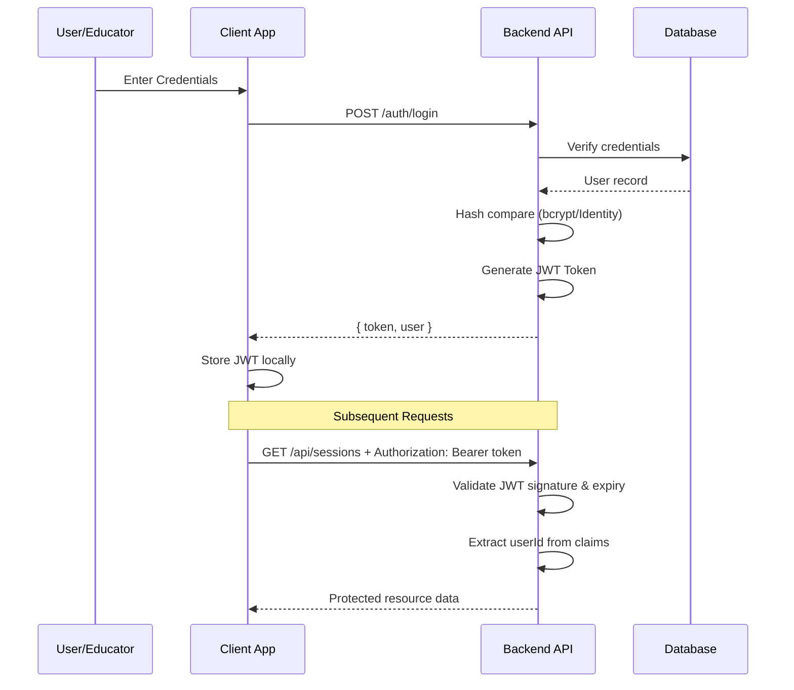
**Figure 4.10:** JWT Authentication Flow — Shared authentication paradigm across both backends.

**Table 4.6:** Security Features Comparison

| Security Feature | Mobile Backend (.NET 8) | Web Backend (NestJS) |
|---|---|---|
| **Password Hashing** | ASP.NET Identity (PBKDF2) | bcrypt (10 salt rounds) |
| **Token Signing** | HMAC-SHA256 | HMAC-SHA256 |
| **Token Expiry** | Configurable (default 7 days) | Configurable (default 7 days) |
| **OAuth 2.0** | — | Google + Facebook |
| **Password Reset** | — | OTP-based with email verification |
| **Input Validation** | Model state validation | ValidationPipe (whitelist + forbidNonWhitelisted) |
| **CORS** | AllowAll policy | Whitelisted origins |
| **Account Deactivation** | — | Soft-delete (deletedAt timestamp) |
| **File Upload Security** | — | MIME type filter + 800KB size limit |
| **API Versioning** | URL segment versioning (`/v1/`) | Global prefix (`/api/`) |
| **API Documentation** | Swagger/OpenAPI with JWT auth | — |

**Mobile Backend JWT Configuration:**

```csharp
services.AddAuthentication(options => {
    options.DefaultAuthenticateScheme = JwtBearerDefaults.AuthenticationScheme;
    options.DefaultChallengeScheme = JwtBearerDefaults.AuthenticationScheme;
}).AddJwtBearer(options => {
    options.TokenValidationParameters = new TokenValidationParameters()
    {
        ValidateIssuer = true,
        ValidIssuer = configuration["Jwt:Issuer"],
        ValidateAudience = true,
        ValidAudience = configuration["Jwt:Audience"],
        ValidateLifetime = true,
        ValidateIssuerSigningKey = true,
        IssuerSigningKey = new SymmetricSecurityKey(
            Encoding.UTF8.GetBytes(configuration["Jwt:SecretKey"]))
    };
});
```

---

### 4.4.7 API Design and Endpoints

#### 4.4.7.1 Mobile Backend API Endpoints

**Table 4.7:** Mobile Backend (.NET 8) — Complete API Reference

| Controller | Method | Route | Description | Auth |
|---|---|---|---|---|
| **Account** | POST | `/api/v1/account/register` | Register a new user account | ❌ |
| **Account** | POST | `/api/v1/account/login` | Authenticate and receive JWT | ❌ |
| **Users** | GET | `/api/v1/users/me` | Retrieve authenticated user profile | ✅ |
| **Sessions** | GET | `/api/v1/sessions` | List all user focus sessions | ✅ |
| **Sessions** | POST | `/api/v1/sessions` | Create a new focus session | ✅ |
| **Devices** | GET | `/api/v1/devices` | List registered devices | ✅ |
| **Devices** | POST | `/api/v1/devices` | Register a new EEG device | ✅ |
| **Devices** | DELETE | `/api/v1/devices/{id}` | Remove a registered device | ✅ |
| **Dashboard** | GET | `/api/v1/dashboard/stats` | Get dashboard statistics | ✅ |
| **Notifications** | GET | `/api/v1/notifications` | List user notifications | ✅ |
| **Notifications** | POST | `/api/v1/notifications` | Create a notification | ✅ |
| **Assessments** | POST | `/api/v1/assessments/health` | Submit health assessment | ✅ |
| **Assessments** | POST | `/api/v1/assessments/tdcs-consent` | Submit tDCS consent | ✅ |

#### 4.4.7.2 Web Platform API Endpoints

**Table 4.8:** Web Platform (NestJS) — Complete API Reference

| Module | Method | Route | Description | Auth |
|---|---|---|---|---|
| **Auth** | POST | `/api/auth/register` | Register new educator account | ❌ |
| **Auth** | POST | `/api/auth/login` | Login with email/password | ❌ |
| **Auth** | POST | `/api/auth/forgot-password` | Request password reset OTP | ❌ |
| **Auth** | POST | `/api/auth/verify-otp` | Verify OTP code | ❌ |
| **Auth** | POST | `/api/auth/resend-otp` | Resend OTP code | ❌ |
| **Auth** | POST | `/api/auth/reset-password` | Reset password with token | ❌ |
| **Auth** | POST | `/api/auth/logout` | Logout (invalidate session) | ✅ |
| **Auth** | GET | `/api/auth/google` | Initiate Google OAuth flow | ❌ |
| **Auth** | GET | `/api/auth/google/callback` | Google OAuth callback | ❌ |
| **Auth** | GET | `/api/auth/facebook` | Initiate Facebook OAuth flow | ❌ |
| **Auth** | GET | `/api/auth/facebook/callback` | Facebook OAuth callback | ❌ |
| **Users** | GET | `/api/users/me` | Get current user profile | ✅ |
| **Users** | PATCH | `/api/users/me` | Update profile details | ✅ |
| **Users** | POST | `/api/users/me/avatar` | Upload profile avatar | ✅ |
| **Users** | PATCH | `/api/users/me/password` | Change password | ✅ |
| **Users** | DELETE | `/api/users/me` | Deactivate account (soft delete) | ✅ |
| **Sessions** | GET | `/api/sessions` | List sessions (paginated) | ✅ |
| **Sessions** | POST | `/api/sessions` | Create monitoring session | ✅ |
| **Sessions** | GET | `/api/sessions/:id` | Get session details | ✅ |
| **Sessions** | PATCH | `/api/sessions/:id` | Update session metadata | ✅ |
| **Sessions** | DELETE | `/api/sessions/:id` | Delete a session | ✅ |
| **Sessions** | POST | `/api/sessions/:id/start` | Start live monitoring | ✅ |
| **Sessions** | POST | `/api/sessions/:id/end` | End monitoring session | ✅ |
| **Sessions** | POST | `/api/sessions/:id/markers` | Add timeline marker | ✅ |
| **Sessions** | POST | `/api/sessions/:id/pause` | Toggle pause/resume | ✅ |
| **Sessions** | POST | `/api/sessions/:id/alert` | Broadcast class alert | ✅ |
| **Sessions** | GET | `/api/sessions/:id/export/pdf` | Export session as PDF | ✅ |
| **Sessions** | GET | `/api/sessions/:id/export/csv` | Export session as CSV | ✅ |
| **Sessions** | GET | `/api/sessions/:id/live-data` | Get live attention data | ✅ |
| **Devices** | GET | `/api/devices` | List registered devices | ✅ |
| **Devices** | POST | `/api/devices` | Register new EEG device | ✅ |
| **Devices** | GET | `/api/devices/:id` | Get device details | ✅ |
| **Devices** | PATCH | `/api/devices/:id` | Update device info | ✅ |
| **Devices** | DELETE | `/api/devices/:id` | Remove device | ✅ |
| **Reports** | GET | `/api/reports` | List generated reports | ✅ |
| **Reports** | POST | `/api/reports/generate` | Generate analytics report | ✅ |
| **Reports** | GET | `/api/reports/:id` | Get report details | ✅ |
| **Reports** | GET | `/api/reports/:id/export` | Export report | ✅ |
| **Dashboard** | GET | `/api/dashboard/stats` | Get dashboard statistics | ✅ |
| **Notifications** | GET | `/api/notifications` | Get user notifications | ✅ |
| **Notifications** | PATCH | `/api/notifications/:id/read` | Mark notification as read | ✅ |
| **Notifications** | PATCH | `/api/notifications/read-all` | Mark all as read | ✅ |
| **Lookups** | GET | `/api/lookups/subjects` | Get available subjects | ❌ |
| **Lookups** | GET | `/api/lookups/grade-levels` | Get grade levels | ❌ |
| **Telemetry** | POST | `/api/telemetry` | Receive raw EEG telemetry | ❌ |

---

### 4.4.8 Backend Process Flow

The following activity diagram illustrates the end-to-end data flow from EEG acquisition to report generation across both backends:

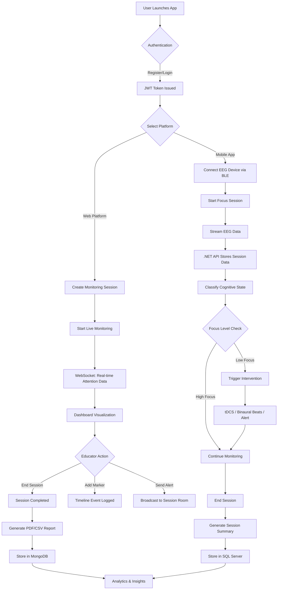
**Figure 4.11:** End-to-End Backend Process Flow — Shows the complete data pipeline from user authentication through session monitoring to report generation.

---

### 4.4.9 Testing Strategy

The platform employs a comprehensive testing strategy across both backends, ensuring reliability and correctness at multiple levels.

#### 4.4.9.1 Mobile Backend Testing (.NET)

The mobile backend organizes tests into three dedicated projects following the testing pyramid:

**Table 4.9:** .NET Testing Projects

| Project | Type | Scope | Framework |
|---|---|---|---|
| `HazeClue.ControllerTests` | Unit Tests | API controllers, request/response validation | xUnit + Moq |
| `HazeClue.ServiceTests` | Unit Tests | Business logic, domain services | xUnit + Moq |
| `HazeClue.IntegrationTests` | Integration Tests | Database operations, full request pipeline | xUnit + TestServer |

#### 4.4.9.2 Web Platform Testing (NestJS)

The web platform uses **Jest** as its testing framework with both unit and end-to-end test capabilities:

**Unit Tests (Service Layer):**

```typescript
describe('SessionsService', () => {
  describe('findAll', () => {
    it('should return paginated sessions', async () => {
      mockSessionModel.find.mockReturnValue(chainable);
      mockSessionModel.countDocuments.mockReturnValue({ exec: jest.fn().mockResolvedValue(1) });
      const result = await service.findAll('userId', 1, 10);
      expect(result.data).toEqual(sessions);
      expect(result.meta.total).toBe(1);
    });
  });

  describe('start', () => {
    it('should throw BadRequestException if session is already active', async () => {
      mockSessionModel.findOne.mockReturnValue({
        exec: jest.fn().mockResolvedValue({ ...mockSession, status: 'active' })
      });
      await expect(service.start('userId', 'sessionId')).rejects.toThrow(BadRequestException);
    });
  });
});
```

**Table 4.10:** Web Platform Test Coverage

| Test File | Module | Test Cases | Coverage Areas |
|---|---|---|---|
| `sessions.service.spec.ts` | Sessions | 9 tests | findAll pagination, findOne validation, create, start/end lifecycle, countByUser |
| `devices.service.spec.ts` | Devices | 8 tests | findAll, findOne validation, create with duplicate check, remove, countByUser |
| `dashboard.service.spec.ts` | Dashboard | 3 tests | Stats aggregation, empty state handling, correct service calls |
| `app.e2e-spec.ts` | App | 1 test | End-to-end HTTP request validation |

**Testing Commands:**

```bash
# Web Platform (NestJS)
npm run test          # Run unit tests
npm run test:cov      # Run with coverage report
npm run test:e2e      # Run end-to-end tests

# Mobile Backend (.NET)
dotnet test HazeClue.ControllerTests/
dotnet test HazeClue.ServiceTests/
dotnet test HazeClue.IntegrationTests/
```
